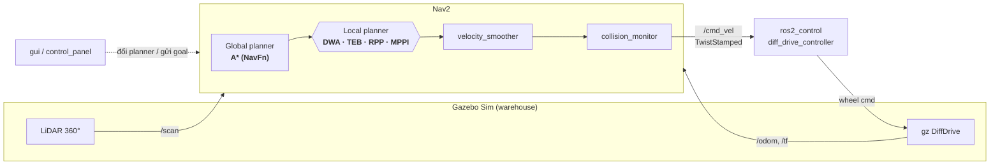

<div align="center">

# 🤖 tap-diff — Bàn thử nghiệm so sánh Local Planner

**Nền tảng mô phỏng một robot vi sai để đánh giá và so sánh 4 thuật toán điều hướng cục bộ của Nav2 — DWA · TEB · RPP · MPPI — trên cùng một global planner A\*.**


-FA6607?logo=gazebo&logoColor=white)


</div>

---

## Mục lục

- [Tổng quan](#-tổng-quan)
- [Kiến trúc](#-kiến-trúc)
- [Bốn thuật toán](#-bốn-thuật-toán)
- [Cấu trúc repo](#-cấu-trúc-repo)
- [Yêu cầu hệ thống](#-yêu-cầu-hệ-thống)
- [Cài đặt & build](#-cài-đặt--build)
- [Sử dụng](#-sử-dụng)
- [Cấu hình & tinh chỉnh](#-cấu-hình--tinh-chỉnh)
- [Khắc phục sự cố](#-khắc-phục-sự-cố)

---

## 🎯 Tổng quan

`tap-diff` là môi trường mô phỏng **một robot** trong một nhà kho, phục vụ đúng
một mục tiêu: **so sánh khách quan các local planner**. Điểm mấu chốt là mọi
yếu tố đều được giữ **cố định** giữa các lần chạy — cùng robot, cùng bản đồ,
cùng lộ trình, cùng global planner (A\*) — và **chỉ** thay đổi local planner
đang xét. Nhờ đó, mọi khác biệt về thời gian, độ mượt hay độ an toàn đều quy về
đúng thuật toán chứ không phải điều kiện chạy.

Các planner được đổi qua lại bằng **nút bấm trên GUI** (hoặc một tham số dòng
lệnh), không cần sửa YAML hay khởi động lại thủ công.

**Điểm nổi bật**

- 🔀 Đổi tức thời giữa **DWA / TEB / RPP / MPPI**, loại trừ lẫn nhau (không tranh `/cmd_vel`).
- 🧭 Global planner **A\*** dùng chung cho cả 4 (`nav2_navfn_planner`, `use_astar: true`).
- 🖥️ **GUI điều khiển** (Tkinter): khởi chạy Gazebo/SLAM/RViz, chọn planner, teleop bằng joystick.
- 🗺️ Warehouse world + bản đồ SLAM có sẵn, robot vi sai với LiDAR 360°.

---

## 🏗️ Kiến trúc

Toàn bộ ngăn xếp điều hướng dùng chung, chỉ **khối local planner** là hoán đổi:



- **Điều khiển bánh**: `ros2_control` với `diff_drive_controller` (chỉ nhận `TwistStamped`, xem [`controllers.yaml`](src/main_bot/config/controllers.yaml)).
- **Định vị**: AMCL trên bản đồ đã lưu, hoặc `slam_toolbox` để dựng bản đồ mới.

---

## 🧠 Bốn thuật toán

Bốn file cấu hình Nav2 **giống hệt nhau** ngoại trừ khối `controller_server.FollowPath`:

| Thuật toán | Plugin | File cấu hình | Cơ chế |
|---|---|---|---|
| **DWA** | `dwb_core::DWBLocalPlanner` | [`nav2_dwb.yaml`](src/main_bot/config/nav2_dwb.yaml) | Dynamic Window — lấy mẫu vận tốc, chấm điểm quỹ đạo bằng critics |
| **TEB** | `teb_local_planner::TebLocalPlannerROS` | [`nav2_teb.yaml`](src/main_bot/config/nav2_teb.yaml) | Timed Elastic Band — tối ưu đồ thị pose bằng g2o |
| **RPP** | `nav2_regulated_pure_pursuit_controller::…` | [`nav2_rpp.yaml`](src/main_bot/config/nav2_rpp.yaml) | Regulated Pure Pursuit — bám điểm nhìn trước, giảm tốc theo cong/cost |
| **MPPI** | `nav2_mppi_controller::MPPIController` | [`nav2_mppi.yaml`](src/main_bot/config/nav2_mppi.yaml) | Model Predictive Path Integral — lấy mẫu ngẫu nhiên hàng nghìn quỹ đạo |

> Cả bốn dùng chung trần vận tốc (0.5 m/s / 1.9 rad/s) và giới hạn gia tốc
> (2.5 / 3.2) để so sánh trên **hành vi bám đường**, không phải trên ngân sách
> tốc độ được cấp.

---

## 📁 Cấu trúc repo

```
tap-diff/
├── src/
│   ├── main_bot/                  # Gói lõi (mô tả robot, launch, config, world, map)
│   │   ├── description/           #   URDF/Xacro: chassis, LiDAR, ros2_control
│   │   ├── config/                #   nav2_{dwb,teb,rpp,mppi}.yaml, controllers, slam
│   │   ├── launch/                #   gz · slam · nav2 · rz (rviz)
│   │   ├── worlds/ · maps/ · rviz/
│   ├── gui/                       # Bảng điều khiển Tkinter (control_panel)
│   ├── teb_local_planner/         # TEB (vendored, cần g2o lúc build)
│   └── costmap_converter/         # Phụ thuộc của TEB (vendored)
└── README.md
```

---

## 💻 Yêu cầu hệ thống

| Thành phần | Phiên bản |
|---|---|
| OS | Ubuntu 24.04 LTS |
| ROS 2 | Jazzy Jalisco |
| Gazebo | Sim 8 (Harmonic) + `ros_gz` |
| Điều hướng | `nav2_bringup`, `slam_toolbox` |
| Plugin planner | `nav2_dwb_controller`, `nav2_regulated_pure_pursuit_controller`, `nav2_mppi_controller`, `nav2_navfn_planner` |

Cài các gói apt cần thiết:

```bash
sudo apt install ros-jazzy-nav2-bringup ros-jazzy-slam-toolbox \
     ros-jazzy-ros-gz ros-jazzy-nav2-dwb-controller \
     ros-jazzy-nav2-regulated-pure-pursuit-controller \
     ros-jazzy-nav2-mppi-controller
```

---

## 🔧 Cài đặt & build

> ⚠️ **Quan trọng — g2o cho TEB.** `teb_local_planner` link tới **g2o** lúc
> build. Máy này không có `ros-jazzy-libg2o` toàn cục; g2o được cài tay ở
> `~/.local/ros-extra-deps/opt/ros/jazzy`. Phải đưa prefix đó vào
> `CMAKE_PREFIX_PATH`, nếu không build sẽ dừng ở `Could not find libg2o!`.

```bash
git clone <repo-url> tap-diff && cd tap-diff

# g2o prefix cho TEB (chỉ cần lúc build)
export CMAKE_PREFIX_PATH=/home/dvt/.local/ros-extra-deps/opt/ros/jazzy:$CMAKE_PREFIX_PATH

colcon build
source install/setup.bash
```

> 💡 Cân nhắc thêm dòng `export CMAKE_PREFIX_PATH=...` vào `~/.bashrc` để lần
> build sau khỏi vấp.

---

## 🚀 Sử dụng

### Cách nhanh nhất — GUI

```bash
ros2 run gui control_panel
```

Trên bảng điều khiển:

1. **Simulation** → *Gazebo* để mở world, *SLAM* (hoặc dùng bản đồ có sẵn), *RViz* để quan sát.
2. **Local planner (global: A\*)** → bấm **DWA / TEB / RPP / MPPI** (loại trừ lẫn nhau).
3. Gửi goal bằng **Nav2 Goal** trên RViz.
4. **Dieu khien thu cong** → joystick teleop (publish thẳng `/cmd_vel`).

### Chạy thủ công bằng dòng lệnh

```bash
ros2 launch main_bot gz.launch.py                 # Gazebo + robot
ros2 launch main_bot slam.launch.py               # (tuỳ chọn) dựng bản đồ
ros2 launch main_bot rz.launch.py                 # RViz (config nav2_view)

# Chọn 1 trong 4 planner:
ros2 launch main_bot nav2.launch.py params_file:=$(ros2 pkg prefix main_bot)/share/main_bot/config/nav2_mppi.yaml
```

---

## ⚙️ Cấu hình & tinh chỉnh

Các tham số dùng chung, đồng nhất trên cả 4 file `nav2_*.yaml`:

| Nhóm | Giá trị | Ghi chú |
|---|---|---|
| `robot_radius` | `0.20` m | Bán kính ngoại tiếp chassis 0.32×0.24 m |
| `inflation_radius` | `0.30` m | robot_radius + ~50% đệm |
| `cost_scaling_factor` | `2.5` | Thấp hơn 3.0 → giữ cost cao xa tường → đi giữa lối, bớt cắt góc |
| Trần vận tốc | `0.5` m/s · `1.9` rad/s | Đồng nhất để so sánh công bằng |
| Gia tốc | `2.5` / `3.2` | Khớp `diff_drive_controller`, tránh bóp nghẹt pipeline |

Chỉnh riêng từng planner trong file `nav2_<x>.yaml` tương ứng.

---

## 🩹 Khắc phục sự cố

| Triệu chứng | Nguyên nhân & cách xử lý |
|---|---|
| Build dừng `Could not find libg2o!` | Thiếu g2o prefix — xem [Cài đặt & build](#-cài-đặt--build). |
| RViz/Gazebo crash `__libc_pthread_init` | `GTK_PATH` do snap của VS Code chèn vào; các launch đã `UnsetEnvironmentVariable('GTK_PATH')`. Chạy từ terminal ngoài nếu vẫn lỗi. |
| Nav2 crash SIGSEGV khi nạp map | Đã đặt `use_composition:=False` (composed bringup lỗi ImageMagick). |
| Teleop không làm robot chạy | `/cmd_vel` là `TwistStamped` — publisher `Twist` thường sẽ bị bỏ qua âm thầm. |
| Robot ì / sát tường | Đã tinh chỉnh gia tốc & `cost_scaling` (xem [Cấu hình](#-cấu-hình--tinh-chỉnh)); tinh chỉnh thêm trong `nav2_<x>.yaml` nếu cần. |

---

<div align="center">
<sub>Xây dựng trên ROS 2 Jazzy · Nav2 · Gazebo Sim — dành cho nghiên cứu & so sánh thuật toán điều hướng.</sub>
</div>
