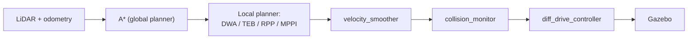

# So sánh các bộ điều khiển cục bộ của Nav2

Môi trường mô phỏng một robot vi sai để khảo sát bốn bộ điều khiển cục bộ
(*local planner* / controller) của Nav2 — DWA, TEB, RPP và MPPI — dưới cùng
một điều kiện. Tất cả chạy trên cùng một robot, cùng một bản đồ và cùng một bộ
quy hoạch toàn cục A\*; chỉ có bộ điều khiển cục bộ được thay đổi giữa các lần
thử. Nhờ vậy, khác biệt quan sát được về quỹ đạo, tốc độ hay khoảng cách an
toàn phản ánh chính thuật toán bám đường chứ không phải điều kiện thử.

Yêu cầu: Ubuntu 24.04, ROS 2 Jazzy, Gazebo Sim 8 (Harmonic), Nav2.

## Bối cảnh

Nav2 tách điều hướng thành hai tầng. Bộ quy hoạch toàn cục tìm một đường đi
khả thi trên bản đồ tĩnh; bộ điều khiển cục bộ bám đường đó theo thời gian
thực, sinh lệnh vận tốc, né vật cản phát sinh và tôn trọng ràng buộc động học
của robot. Với cùng một đường đi toàn cục, các bộ điều khiển cục bộ khác nhau
cho ra hành vi rất khác nhau, đặc biệt ở những đoạn lối hẹp và góc cua.

So sánh chúng một cách công bằng đòi hỏi loại bỏ mọi khác biệt ngoài bản thân
thuật toán: cùng robot, cùng bản đồ, cùng đường đi toàn cục, cùng trần vận tốc
và gia tốc. Đó là điều kho mã này thiết lập sẵn.

## Kiến trúc

Cả bốn cấu hình dùng chung một chuỗi xử lý; chỉ khối bộ điều khiển cục bộ được
hoán đổi:



Định vị dùng AMCL trên bản đồ đã lưu, hoặc `slam_toolbox` khi cần dựng bản đồ
mới. Toàn bộ chuỗi vận tốc phát và nhận `TwistStamped`, vì
`diff_drive_controller` của `ros2_control` chỉ chấp nhận kiểu này trên
`/cmd_vel`.

## Bốn bộ điều khiển

Bốn tệp cấu hình Nav2 chỉ khác nhau ở khối `controller_server.FollowPath`;
mọi phần còn lại giữ nguyên.

| Thuật toán | Plugin | Cấu hình | Nguyên lý |
|---|---|---|---|
| DWA  | `dwb_core::DWBLocalPlanner` | [`nav2_dwb.yaml`](src/main_bot/config/nav2_dwb.yaml) | Lấy mẫu không gian vận tốc khả thi, chấm điểm quỹ đạo bằng tập critics |
| TEB  | `teb_local_planner::TebLocalPlannerROS` | [`nav2_teb.yaml`](src/main_bot/config/nav2_teb.yaml) | Tối ưu một dải pose theo thời gian, khoảng cách và ràng buộc bằng g2o |
| RPP  | `nav2_regulated_pure_pursuit_controller::RegulatedPurePursuitController` | [`nav2_rpp.yaml`](src/main_bot/config/nav2_rpp.yaml) | Bám điểm nhìn trước, tự giảm tốc theo độ cong và cost |
| MPPI | `nav2_mppi_controller::MPPIController` | [`nav2_mppi.yaml`](src/main_bot/config/nav2_mppi.yaml) | Lấy mẫu ngẫu nhiên nhiều quỹ đạo, lấy trung bình có trọng số theo chi phí |

Công bố gốc của từng thuật toán ở phần [Tham khảo](#tham-khảo).

## Robot và bản đồ

Robot là một nền vi sai hai bánh chủ động, thân hộp 0.320 × 0.240 × 0.078 m,
bánh bán kính 0.05 m cách nhau 0.266 m, mang một LiDAR 2D 360 tia (10 Hz, tầm
0.08–10 m). Bán kính ngoại tiếp thân là 0.20 m; đây cũng là `robot_radius`
dùng cho costmap. Mô tả URDF trong [`description/`](src/main_bot/description/)
dựng theo đúng bản vẽ cơ khí và khung thật dưới đây:

<table>
<tr>
<td width="50%"></td>
<td width="50%"></td>
</tr>
<tr>
<td align="center"><sub>Bản vẽ CAD — khung, vị trí LiDAR và khoang điện tử</sub></td>
<td align="center"><sub>Robot chạy thử ngoài đời, cùng cấu hình bánh và cảm biến</sub></td>
</tr>
</table>

Bản đồ là một nhà kho ([`worlds/warehouse.sdf`](src/main_bot/worlds/warehouse.sdf))
với kệ hàng và lối đi hẹp — chỗ hẹp nhất chỉ khoảng 0.95 m tính từ tâm lối tới
tường, đủ để phân biệt bộ điều khiển nào giữ được đường và bộ nào cắt góc.
Ảnh bản đồ đã lưu ở [`maps/warehouse.yaml`](src/main_bot/maps/warehouse.yaml),
độ phân giải 0.05 m/ô.

## Điều kiện giữ cố định

Những tham số dưới đây đồng nhất trên cả bốn tệp cấu hình. Chúng là điều làm
cho phép so sánh có ý nghĩa: không thuật toán nào được cấp một ngân sách tốc
độ, một bán kính an toàn hay một đường đi toàn cục thuận lợi hơn thuật toán
khác.

| Tham số | Giá trị |
|---|---|
| Bộ quy hoạch toàn cục | A\* (`NavfnPlanner`, `use_astar: true`) |
| Trần vận tốc | 0.5 m/s tịnh tiến, 1.9 rad/s quay |
| Trần gia tốc | 2.5 m/s², 3.2 rad/s² |
| `robot_radius` | 0.20 m |
| `inflation_radius` | 0.30 m |
| `cost_scaling_factor` | 2.5 |
| Tần số điều khiển | 20 Hz |
| Dung sai đích | 0.25 m, 0.25 rad |

Trần gia tốc đặt bằng đúng giới hạn của `diff_drive_controller`
([`controllers.yaml`](src/main_bot/config/controllers.yaml)); đặt cao hơn chỉ
khiến tầng chặt hơn âm thầm thắng. `cost_scaling_factor` để ở 2.5 (thấp hơn
mặc định 3.0) nên cost quanh vật cản giảm chậm hơn, giữ robot bám giữa lối và
hạn chế cắt góc trong không gian hẹp này.

## Cài đặt

TEB liên kết với thư viện tối ưu **g2o** ngay lúc biên dịch. Máy phát triển
không có gói `ros-jazzy-libg2o` toàn hệ thống, nên g2o được cài vào một prefix
cục bộ (`~/.local/ros-extra-deps/opt/ros/jazzy`). Prefix này phải nằm trong
`CMAKE_PREFIX_PATH` trước khi build, nếu không CMake dừng ở `Could not find
libg2o!`. Các gói còn lại build bình thường.

Cài các gói phụ thuộc:

```bash
sudo apt install ros-jazzy-nav2-bringup ros-jazzy-slam-toolbox ros-jazzy-ros-gz \
     ros-jazzy-nav2-dwb-controller \
     ros-jazzy-nav2-regulated-pure-pursuit-controller \
     ros-jazzy-nav2-mppi-controller
```

Biên dịch từ thư mục gốc của workspace:

```bash
export CMAKE_PREFIX_PATH=/home/dvt/.local/ros-extra-deps/opt/ros/jazzy:$CMAKE_PREFIX_PATH
colcon build
source install/setup.bash
```

Dòng `export` chỉ cần thiết lúc build TEB; thêm vào `~/.bashrc` để khỏi lặp lại.

## Chạy thử

Cách nhanh nhất là dùng bảng điều khiển đồ hoạ:

```bash
ros2 run gui control_panel
```

Trình tự thông thường: mở Gazebo, chạy SLAM (hoặc dùng bản đồ có sẵn), mở
RViz, rồi bấm chọn một trong bốn bộ điều khiển ở mục *Local planner*. Bốn nút
này loại trừ lẫn nhau — chọn bộ mới sẽ tắt bộ đang chạy để hai
`controller_server` không tranh nhau `/cmd_vel`. Gửi đích bằng công cụ Nav2
Goal trong RViz; ô joystick bên dưới cho phép lái tay khi cần.

Tương đương bằng dòng lệnh:

```bash
ros2 launch main_bot gz.launch.py
ros2 launch main_bot slam.launch.py      # hoặc bỏ qua nếu đã có bản đồ
ros2 launch main_bot rz.launch.py

# chọn một bộ điều khiển:
ros2 launch main_bot nav2.launch.py \
    params_file:=$(ros2 pkg prefix main_bot)/share/main_bot/config/nav2_mppi.yaml
```

## Bố cục thư mục

```
src/
├── main_bot/            gói lõi: mô tả robot, launch, cấu hình, world, bản đồ
│   ├── description/     URDF/Xacro cho chassis, LiDAR, ros2_control
│   ├── config/          nav2_{dwb,teb,rpp,mppi}.yaml, controllers, slam
│   ├── launch/          gz, slam, nav2, rz
│   └── worlds/ maps/ rviz/
├── gui/                 bảng điều khiển Tkinter (control_panel)
├── teb_local_planner/   TEB, kèm theo mã nguồn (cần g2o lúc build)
└── costmap_converter/   phụ thuộc của TEB
```

## Tinh chỉnh

Tham số riêng của từng thuật toán nằm trong khối `FollowPath` của tệp
`nav2_<x>.yaml` tương ứng. Tham số dùng chung (bảng ở trên) nên chỉnh đồng bộ
trên cả bốn tệp, nếu không phép so sánh mất tính công bằng.

## Ghi chú vận hành

- **Lái tay không làm robot chạy.** `/cmd_vel` là `TwistStamped`; một publisher
  gửi `Twist` thường sẽ bị bỏ qua âm thầm do lệch kiểu thông điệp.
- **RViz hoặc Gazebo tắt ngay khi mở, kèm lỗi `__libc_pthread_init`.** Biến môi
  trường `GTK_PATH` do bản snap của VS Code chèn vào terminal tích hợp. Các
  launch đã `UnsetEnvironmentVariable('GTK_PATH')`; nếu vẫn gặp, chạy từ một
  terminal ngoài.
- **Nav2 báo SIGSEGV khi nạp bản đồ.** Bringup dạng gộp tiến trình gặp lỗi trong
  ImageMagick; các launch ở đây đặt `use_composition:=False` để chạy tiến trình
  riêng.

## Tham khảo

1. D. Fox, W. Burgard, S. Thrun. "The Dynamic Window Approach to Collision Avoidance." *IEEE Robotics & Automation Magazine*, 1997.
2. C. Rösmann và cộng sự. "Trajectory Modification Considering Dynamic Constraints of Autonomous Robots." *ROBOTIK*, 2012; "Efficient Trajectory Optimization Using a Sparse Model." *ECMR*, 2013.
3. S. Macenski, S. Singh, F. Martín, J. Ginés. "Regulated Pure Pursuit for Robot Path Tracking." *Autonomous Robots*, 2023.
4. G. Williams và cộng sự. "Model Predictive Path Integral Control: From Theory to Parallel Computation." *Journal of Guidance, Control, and Dynamics*, 2017.
5. S. Macenski và cộng sự. "The Marathon 2: A Navigation System." *IROS*, 2020. Tài liệu Nav2: <https://docs.nav2.org>.

## Giấy phép

`teb_local_planner` và `costmap_converter` là mã bên thứ ba, giữ giấy phép gốc
(BSD). Phần mã còn lại trong kho chưa gắn giấy phép cụ thể.
